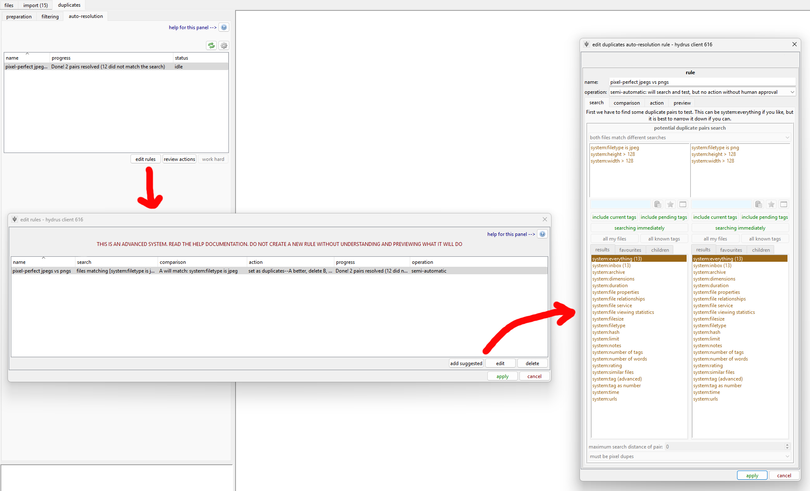
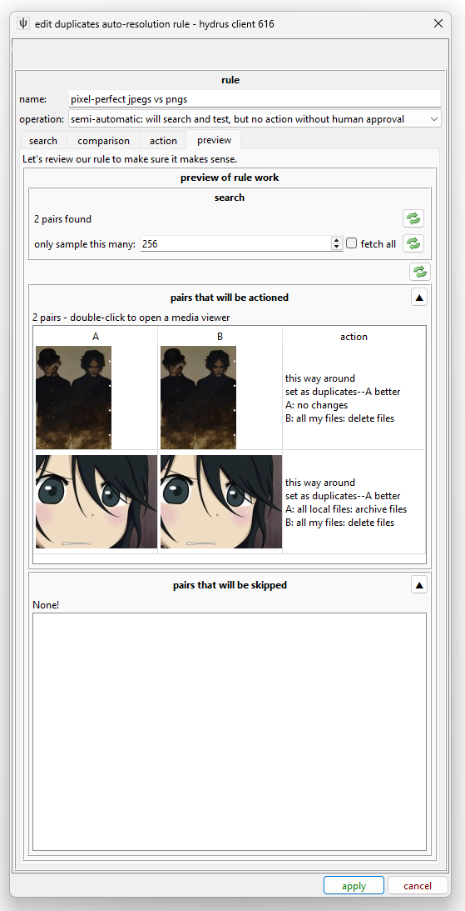
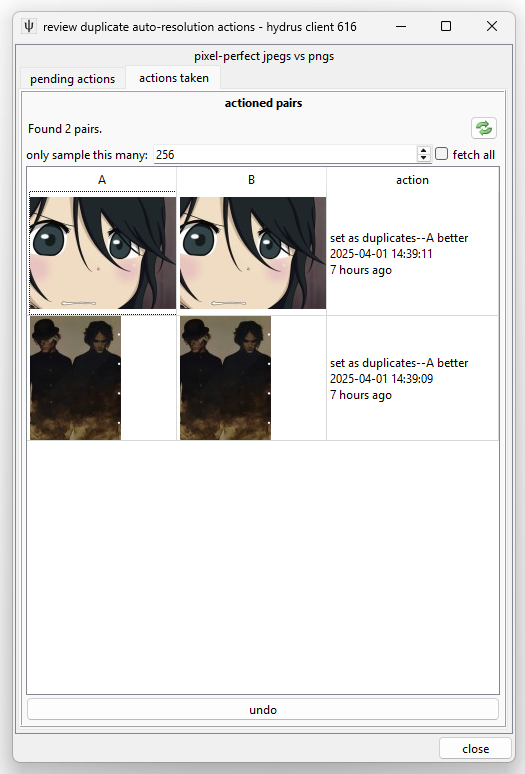

**Hey, this is all for a system that is still being worked on. Start slow, and let me know how it works for you!**

## the problem with duplicates processing

The duplicates filter can get pretty tedious. Pairs that are obvious resizes or pixel duplicates are easy to resolve but boring to work through.

If only there were some way to automate common decisions! We could have hydrus solve these trivial duplicates in the background, leaving us with less, more interesting work to do.

!!! warning "Be careful!"
    Automated systems are powerful magic wands, and we should always be careful waving them around. Make sure you are hesitant rather than confident and always check the preview tab to make sure what you are about to do makes sense. There's no undo once a rule starts going!
    
    If you plan to do something huge, like deleting 50,000 files, make a backup before it starts.

!!! info "Everything is off by default"
    Resolving duplicates is a highly subjective issue. Maybe you think EXIF data is the best, or maybe you always want it gone. Maybe you never want to delete low quality files, or always merge URLs, or set an artist correction as a duplicate instead of an alternate. People simply differ.
    
    This system has templated quick-start suggestions, but they are not mandatory. The intention is to let you set up what you want how you want. Everything is off by default!

## duplicates auto-resolution

So, let's start with a simple and generally non-controversial example: pixel-duplicate jpeg & png pairs.

When converting between typical image formats, if you save to a jpeg, the output file will have some new 'fuzzy' artifacts, but if you save a png, it is pixel perfect to the original. This is one of the reasons why jpegs of rich images tend to be smaller than pngs--jpegs are a _lossy_ simulation and compress well, pngs are _lossless_ and have to account for everything perfectly.

Thus, when you have a normal potential duplicate pair that is pixel-duplicates (i.e. they have exactly the same pixel image content) and which has one jpeg and one png, you _know_, for certain, that the png is a copy of the jpeg. The lossless pixel-perfect copy was made from the lossy original. This happens most often when someone is posting from one application to another, or with a phone, where rather than uploading the source jpeg, they do 'copy image' and paste that into the upload box--the browser eats the bitmap on the clipboard and creates the accursed 'Clipboard.png', and it all eventually percolates to our clients as duplicate spam.

In this case, we always want to keep the (usually smaller, original) jpeg and ditch the (bloated, derived) png. In the duplicates system, this would be:

- A two-part duplicates search, for 'system:filetype is jpeg' and 'system:filetype is png', with 'must be pixel dupes'.
- Arranging each incoming pair as 'the jpeg is A, the png is B'
- Sending the duplicate action of 'set A as better than B, and delete B'.

We could follow this script every time and be happy with it. Let's do it!

### auto-resolution tab

Go to the duplicates filtering page and switch to the 'auto-resolution' tab. This shows all your active auto-resolution rules and what they are currently doing. Hit `edit rules` to get started.

### search

Each rule represents a search, a way of testing pairs, and then a duplicate action. There's a button to add suggested rules. Try adding 'pixel-perfect jpegs vs pngs'.

Note that in addition to the jpeg/png filetype predicates, I have added `width > 128` and `height > 128` to each search. I said above that we are confident of this rule for _normal_ images, but what about 16x16 icons? There a jpeg might, by chance, be a pixel-perfect match of a png, and maybe we want to keep the png anyway for odd cases.

!!! info "Specific search is good"
    Note, of course, that we didn't have to add our width and height predicates to the 'png' side, since both files in a pixel-perfect pair will have the same resolution. However, the duplicates auto-resolution system runs faster with more specific searches, since this reduces the number of files and pairs it needs to track for a specific rule.
    
    Try to make a specific search if you can--not always 'system:everything'.

### comparison

Now let's look at the comparison tab:

Since we know that every incoming search pair will include one jpeg and one png, we can simply define that A has to be the jpeg.

You can get more complicated:

### action

The 'action' tab simply sets what we want to do. This all works the same way as in the duplicate filter. For our rule, we want to say A, the jpeg, is better, and we want to delete B, the worse png. We'll leave the content merge options as the default, merging tags and ratings and so on just as we would for a 'set better than' in a normal duplicate filter.

### preview

Lastly, we want to check what we are about to do. We'll see how many pairs the search produces and how many pass or fail our comparison test.

This may run a little slow, but bear with it. You can double-click a row to see the pair in a normal media viewer.

In our simple jpeg/png pixel duplicates, nothing will fail the test, because we only selected for `A == jpeg`, and since every pair will have exactly one jpeg, the test is always satisfiable. If you were testing for comparable filesize, you would likely see some that do not match. Non-matching pairs will not be touched by the rule in any way.

Note also that the matching pairs may or may not have a specific order. If you set ambiguous comparison rules, it may be that a pair could set its AB as 1,2 or 2,1, and if that's the case, it will say so--and if you spam the refresh button, you'll see those rows flip back and forth. Ambiguous AB order is fine if you are setting 'alternates' or 'same quality', but know that hydrus will choose 1,2 or 2,1 randomly when it does its work for real, so it is simply not appropriate for 'better than'. If you need to fix this situation, go back to the 'comparison' tab and tighten up the rules.

There is also a preview of the content updates A and B will receive. This can get complicated, with tags, ratings, notes, urls, and more. If it looks wrong, check your duplicate metadata merge options!

Once we are happy, we can apply the dialogs and save our rule back. It will start working immediately.

### semi and fully automatic

Rules can either be 'semi-automatic' or 'fully automatic'. They have the all same settings, and they will search and test pairs the same way, but semi-automatic rules will not perform their final duplicate action without your approval. Fully automatic rules are fire-and-forget, and will do everything without your interference.

You might like to start your rules in semi-automatic, and if you don't encounter any false-positives after a bit of work, then you can more confidently switch it to fully automatic.

## so, how does this all work?

When you add a new rule, hydrus will throw all the current potential duplicate pairs at the rule and then work in brief background packets, searching for pairs and then running them against the comparsion test. Semi-automatic rules will queue ready-to-action pairs for your approval, but fully automatic rules will go ahead and action them immediately. The list on the duplicates page will update with a live summary.

Click 'review actions' to see it in more detail:

This panel shows pairs a semi-automatic rule is prepared to action. Select those that are good and click 'approve', click 'deny' for any that are false positives. If a rule needs you to click 'deny' a lot, it probably needs tighter search or comarison. The ideal of these rules is automation!

This shows everything the rule has actioned. The 'undo' button is serious and will be inconvenient to you, so try not to rely on it.

When you import new files and the regular potential dupes search (on the 'preparation' tab of the duplicates page) finds new pairs amongst them, the auto-resolution rules will be told about them and will quickly see if they can action them. You can force the system to work a bit harder on a particular rule if you want to catch up somewhere, but normally you can just leave it all alone and be happy that it is saving you time in the background.

## now what?

Once you have played with easy jpg/png pixel duplicates, try out some of the other pixel-duplicate suggested rules. If you have a preference one way or another, you might like to tweak the search--maybe you only want it for jpegs, or only for files smaller than 3MB.

I strongly recommend you stay on semi-automatic until you are very confident your rules are set up how you want. Once you set them to automatic, you probably aren't going to look at them much any more!

Once you are comfortable with things, I would like you to play with my new visual duplicates tool:

#### A and B are visual duplicates

I wrote an algorithm specifically for this system that renders and inspects two images and uses a lot of math to determine if they are "visual duplicates". Imagine it as a much more precise version of the original similar file serach that populates the "potential duplicates" queue. It ignores compression artifacts but will recognise artist corrections or alternates or recolours. Because we want to trust it eventually making automatic decisions, the algorithm is intended to be as very confident when it does say "yes they are duplicates", so I have tuned it to err on the side of a false negative (it sometimes says that a pair of files are not duplicates when they actually are, but it will very rarely say that two files are duplicates when they are not). It works pretty well, and I encourage users try it out at "almost certainly" confidence and in semi-automatic mode. Once we are confident in its tuning and in how it should be best set up, I will encourage testing in automatic mode.

You can add it as a kind of comparator rule. Set the confidence and it'll filter out anything it doesn't think are visual duplicates. Note that this tool is CPU expensive--about a second of time for each pair actioned--so try to limit the prior search space. Don't have it operate on a similar files search distance of 12, for instance! There's a suggested rule called "visually similar pairs - eliminate bloat" that shows how you might use it.

My hope is we can eventually eliminate many many easy duplicate decisions with this tool. Let me know how it goes, and if you discover a false positive pair, I am very interested in seeing it!

## future

We need more comparison tools. I'd like to migrate more of the system predicate logic to the comparators, and add simple tag tests, and add some more hardcoded tools for specific situations. I may start thinking about the whole problem from the opposite angle, also, by detecting and actioning pairs we are confident are alternates.

I'd also eventually love if auto-resolution rules applied to files _as_ they are imported, so, in the vein of a 'previously deleted' import result, you could have an instant result of 'duplicate discarded: (rule name)'. This may be tricky though and make file imports take +800ms each, so we'll see how our early tests shake out.

If you try out the system, thank you. Let me know how it works and I'll keep iterating.
